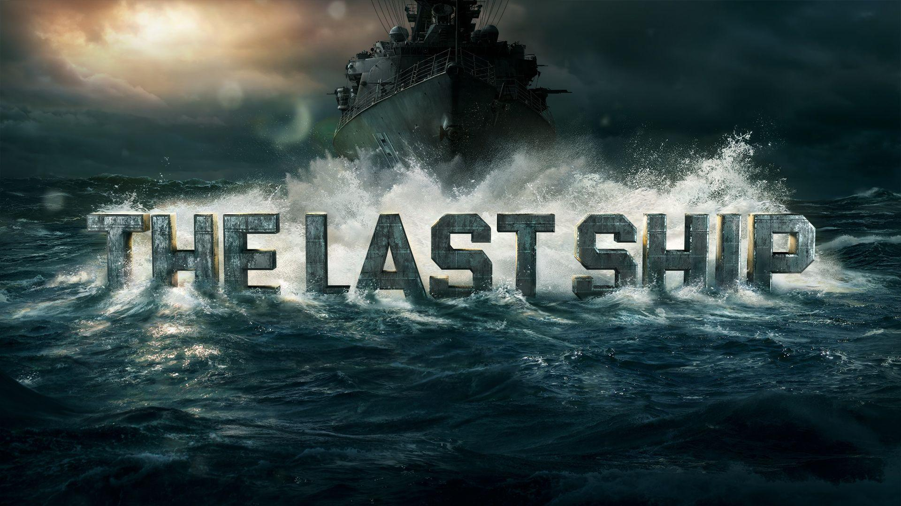
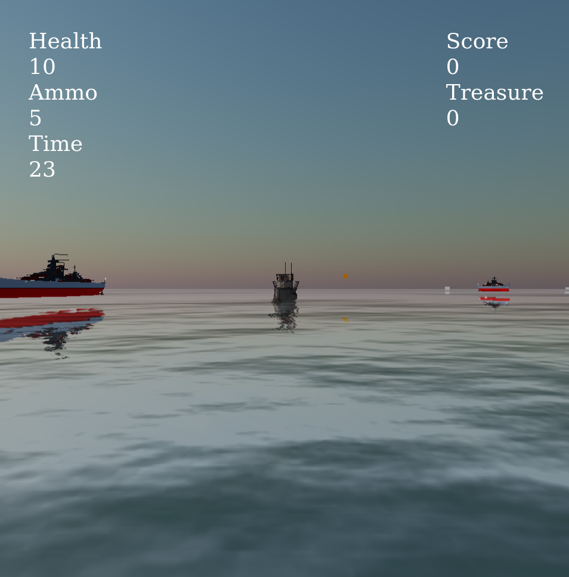
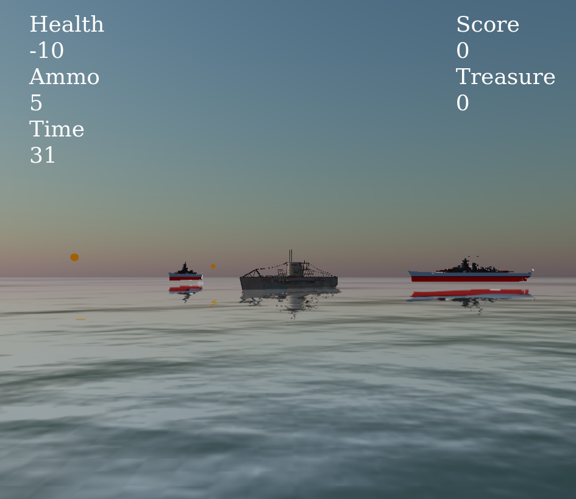
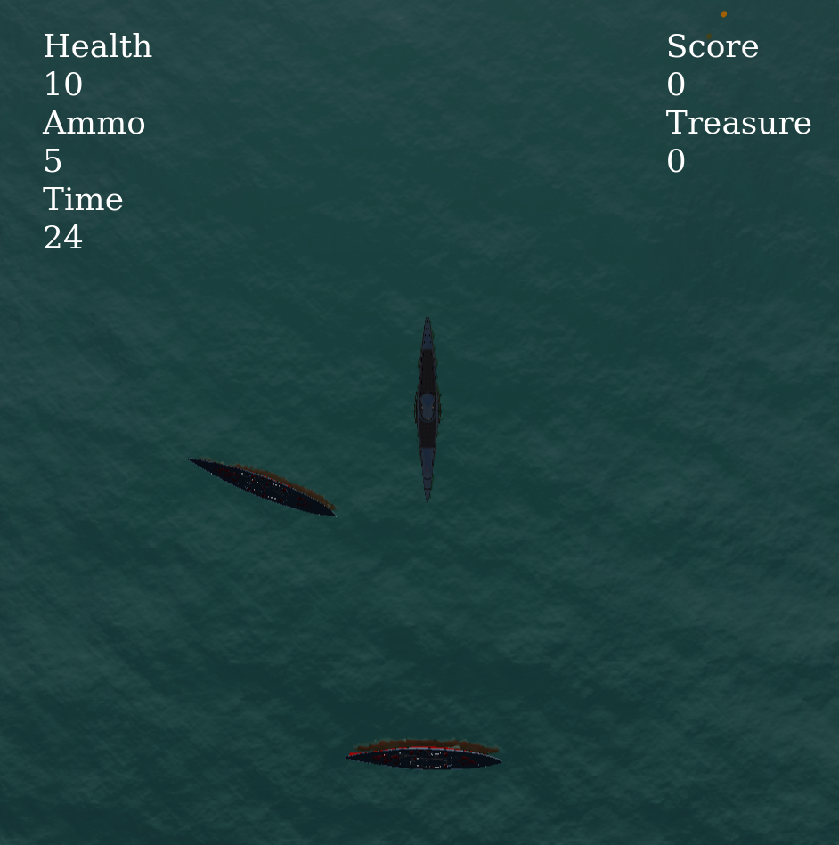

# The-Last-Ship

 

### Survive through the braveries of ocean , filled with enemy war ships and sail through the world surviving .

### To Play :
- cd to the game folder 
- npm i 
- run npm run dev 
- move over to localhost:3000 , and enjoy !!

### Features 
#### Controls : 
- <kbd>W</kbd> : To steer ship forward
- <kbd>A</kbd> : To steer ship left
- <kbd>S</kbd>  : To steer ship backward
- <kbd>D</kbd> : To steer ship left
- <kbd>Space</kbd>  : To shoot enemies
  
#### Camera : 
- <kbd>B</kbd> : To switch to bird's eye view
- <kbd>C</kbd> : To switch to closeup view
- <kbd>O</kbd> : To switch to view with camera at fixed position , looking at ship

#### Scoring : 

- You get a **-50** on colliding with the enemy ship 
- You get a **+100** on destroying the enemy ship 
- You get a **+100** on collecting the treasure chest spreaded across the sea 
- An enemy collision deals a **20** health damage to the player boat and an enemy bullet deals a **10** health damage to the player boat.

#### Stills from the Game 

##### Game :

 

##### Closeup View :

 

##### Top View :

